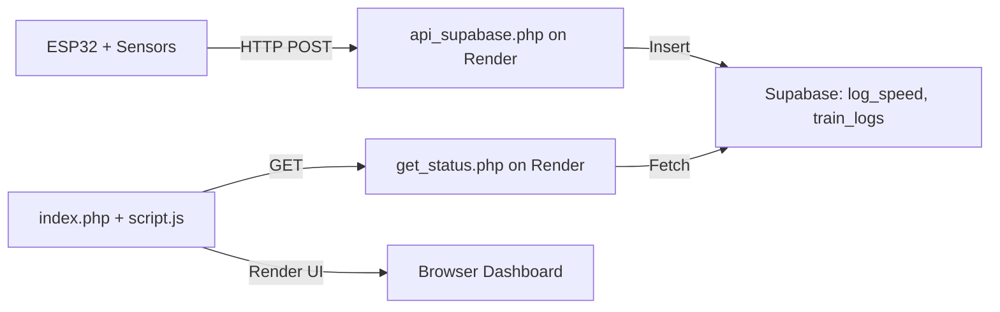

# Railway Monitoring Dashboard

**URL Demo**: https://train-dashboard.onrender.com

## Overview

This project implements a real-time railway monitoring dashboard using ESP32, Supabase (PostgreSQL), and a PHP web application hosted on Render.com. The dashboard displays:

* 🚦 **Train signals** (red, yellow, green) at checkpoints CP1–CP5 and station platforms (SU, SS)
* 🚆 **Train status**: running and parking positions
* 🛤️ **Route direction** based on parking status
* 📊 **Speed panels**: speed level (full, medium, stopped), control mode (manual/otomatis), and indicator color (hijau/kuning/merah)
* 🔄 Automatic data refresh every 5 seconds

## Architecture



## Features

1. **Data Ingestion**

   * ESP32 pushes sensor data (checkpoint, status) to `train_logs` and speed data (`kecepatan`, `mode`, `warna`) to `log_speed` via `api_supabase.php`.
2. **Row-Level Security**

   * Supabase RLS policies allow anonymous INSERT into `train_logs` and `log_speed`, and SELECT for `get_status.php`.
3. **Web Dashboard**

   * `get_status.php` aggregates logs to determine running & parking trains, signal lights, and route.
   * `script.js` updates UI panels and lights in real-time.
   * Speed panels display speed level, mode, and color.

## Getting Started

### Prerequisites

* PHP 8.x
* Composer (optional if dependencies are needed)
* Render.com account
* Supabase project with tables `train_logs` and `log_speed`
* ESP32 development environment (Arduino IDE)

### Supabase Setup

1. Create tables:

   ```sql
   -- train_logs
   create table train_logs (
     id serial primary key,
     checkpoint varchar,
     status varchar,
     timestamp timestamp default now()
   );

   -- log_speed
   create table log_speed (
     id serial primary key,
     kecepatan integer,
     mode text,
     warna text,
     created_at timestamp default now()
   );
   ```
2. Enable RLS and policies:

   ```sql
   alter table train_logs enable row level security;
   create policy "Allow insert anon" on train_logs for insert to public using (true) with check (true);
   alter table train_logs enable row level security;
   create policy "Allow select anon" on train_logs for select to public using (true);

   alter table log_speed enable row level security;
   create policy "Allow insert anon" on log_speed for insert to public using (true) with check (true);
   create policy "Allow select anon" on log_speed for select to public using (true);
   ```
3. Get **Project URL** and **anon key** from Supabase Settings → API.

### Render.com Deployment

1. **Clone** this repository to your GitHub.
2. Create a **new Web Service** on Render:

   * **Type**: PHP (Use Docker with provided `Dockerfile`)
   * **Build Command**: `docker build -t rail-dashboard .`
   * **Start Command**: `docker run -p 10000:80 rail-dashboard`
3. **Environment Variables** (in Render dashboard):

   * `SUPABASE_URL`: your Supabase URL (e.g. `https://xyz.supabase.co`)
   * `SUPABASE_ANON_KEY`: your Supabase anon key

### Configuration

* **api\_supabase.php**: handles `mode=log_speed` POST/GET and inserts/selects from Supabase
* **get\_status.php**: aggregates `train_logs` to JSON status
* **index.php**: HTML structure for dashboard
* **script.js**: client-side JS to fetch and render data
* **style.css**: custom styles for dashboard layout

### ESP32 Sketch

1. Update `api_supabase_url` in `esp32_*.ino` to point to your Render service endpoint.
2. Use HTTPClient in Arduino to POST checkpoint and speed data.

## Usage

1. Access the dashboard URL on Render.com.
2. ESP32 will start sending data; the dashboard will auto-refresh every 5 seconds.
3. Panels and lights will reflect real-time train positions and speed.

## License

MIT License

---

*Generated by Thariqhat Rama Putra*
